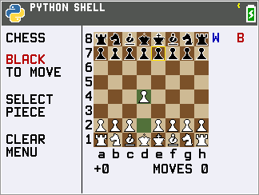

# TI-84 Evo-T Chess

A compact, fully graphical chess game built specifically for the **TI-84
Evo-T**. Play locally against another person or challenge the built-in AI at
three difficulty levels—all from the calculator's Python environment.

## Features

- One-player and two-player modes
- Graphical pieces, move highlights, captured pieces, and material scores
- Castling, en passant, promotion, checkmate, and stalemate
- Undo support and a memory-conscious design tuned for Evo-T hardware

## Controls

Use the arrow keys to move the cursor, `ENTER` to select a piece or make a
move, `DEL` to undo, and `CLEAR` to go back or open the menu.

## Download and play

You do not need to build the game yourself:

1. Open the [latest release](https://github.com/gcmvanloon/ti84evoChess/releases/latest).
2. Under **Assets**, download `chess_evo_min.py`.
3. Transfer that file to your TI-84 Evo-T with your usual calculator file
   transfer software.
4. Open the calculator's Python app and run `chess_evo_min.py`.

## For tinkerers: build your own version

Want to change the game or choose a different build profile? Clone or download
this repository and edit `chess_evo.py`, the readable source. Open the project
in its supplied VS Code Dev Container, then press `Ctrl+Shift+B` to generate a
calculator-ready `chess_evo_min.py`.

See [BUILDING.md](BUILDING.md) for the one-time setup, available build profiles,
and validation steps. Always transfer the generated `chess_evo_min.py` to the
calculator rather than the readable source file.

This project is available under the [MIT License](LICENSE).
